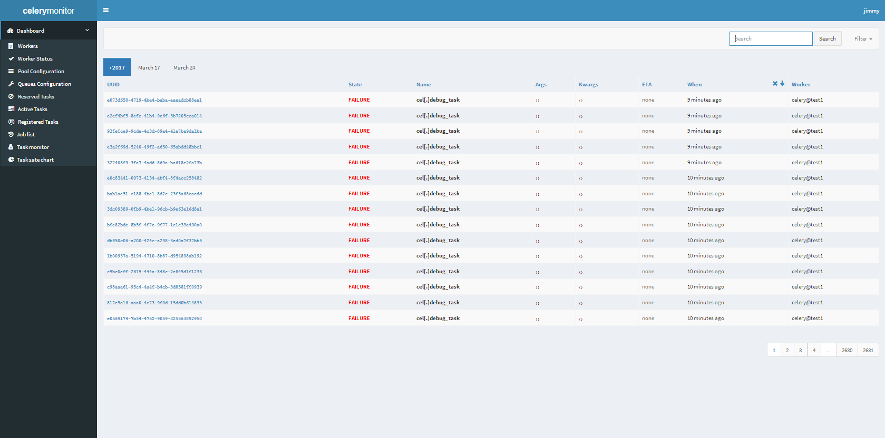
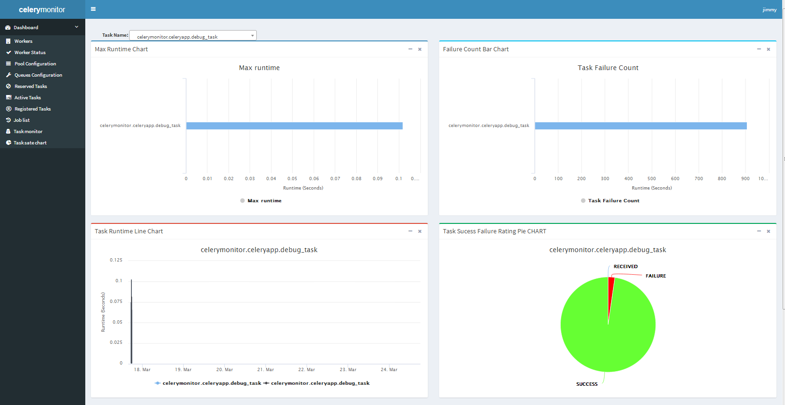

# celery monitor

Celery task monitoring and management application. This project aims to replace the celery monitor tools flower.Celery monitor aims to integrate django and celery monitor.
### [Deployment tutorial guide for celery](./doc/Deploymentguide.md)
# screenshot

